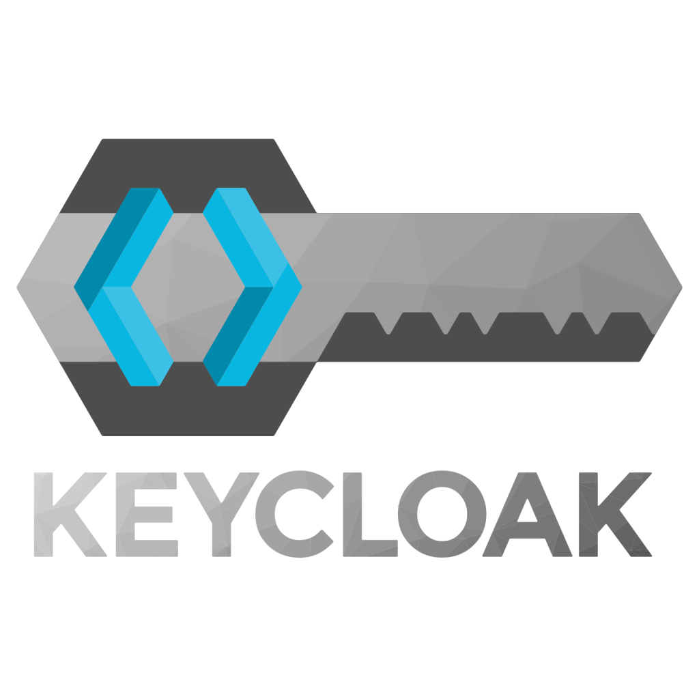

<h3 align="center">

</h3>
<h2 align="center">
  Configurações Keycloak
</h2>

## Configurações Keycloak e Postgres

1. Abra o arquivo **docker-compose.yaml** e altere as configurações padrões de senha e nomes.

2. Pelo terminal, acesse a pasta do repositório e execute\*

   ```
    docker-compose up -d
   ```

   \* para esse parte é necessário já ter o docker instalado e configurado

   Ao subir esse container o Postgres e o Keycloak estaram rodando.

   A pasta do tema (app-theme) não está configurada no container, é necessário entrar nela e rodar o comando abaixo para baixar as dependências.

   ```
   yarn
   ```

   Depois é só fazer o comando

   ```
   yarn start
   ou
   yarn build
   ```

   para gerar o build do theme

3. ### Criar um novo Realm

   Acesse o Keycloak pelo navegador. Ex: http://localhost:8088

   Obs: Por padrão já em cadastrado o realm Master. Mas ele não deve ser usado para a aplicação. Por isso é necessário criar um novo.

4. ### Criar um novo client

   ClientID (nome do client)<br>
   Client Protocol (openid-connect)<br>
   Root URL (url da aplicação - frontend)<br>

5. ### Selecionar o tema personalizado no Keycloak

6. ### Acesse a rota de login

   http://localhost:8088/auth/admin/app/console/

   ***

   Login não está funcionando ainda
